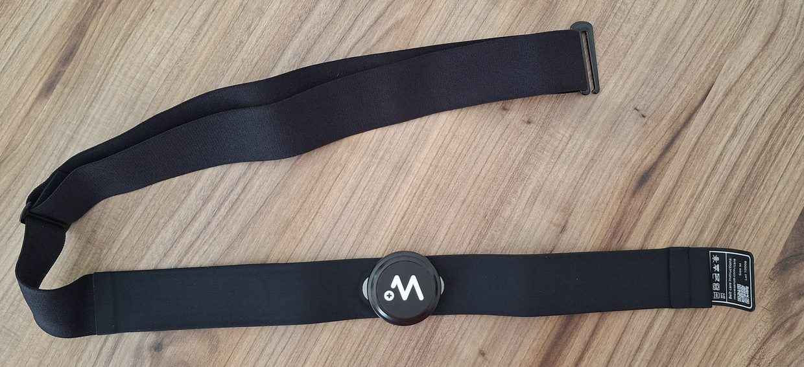
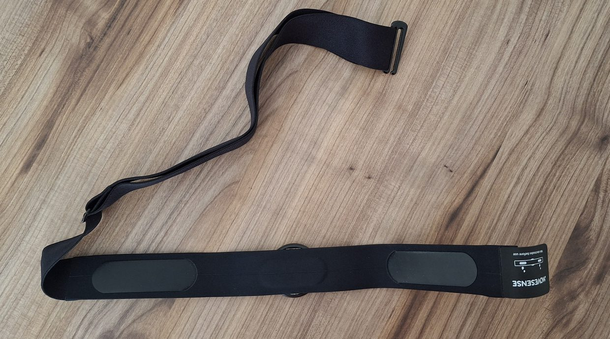
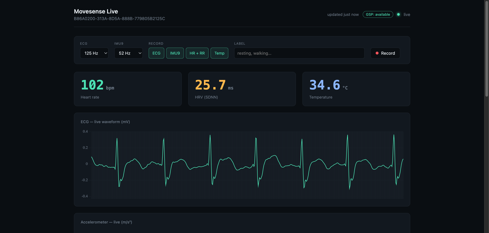
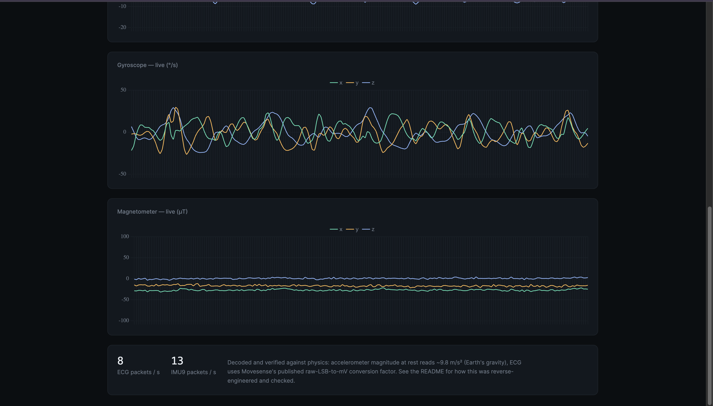

# Movesense Live Dashboard

Streams ECG, IMU9 (accelerometer, gyroscope, magnetometer), heart rate and
temperature from a Movesense MD sensor to a browser over Bluetooth Low
Energy, and records labelled sessions to CSV for machine learning.
Movesense's mobile SDK targets Android and iOS, so the sensor is read here
over GSP, the protocol they provide for clients that don't run it.

A backend (bleak + FastAPI) talks to the sensor and forwards everything
over a WebSocket. The frontend is one HTML file.

[](https://github.com/sumeyye-agac/movesense-ecg-hrv-dashboard/actions/workflows/tests.yml)





The hardware: a Movesense MD sensor in its chest belt, and the electrode
pads on the inside that pick up the ECG.





Top and bottom of the same page.

## Run it

```bash
pip install -r backend/requirements.txt

cd backend
python scan.py            # prints your sensor's BLE address
cp .env.example .env      # put the address in it
uvicorn main:app --reload
```

Then serve the frontend and open <http://localhost:8080>:

```bash
python -m http.server 8080 --directory frontend
```

Without a sensor address the backend still starts, so the frontend and the
API can be run without hardware.

Tests: `python -m unittest discover backend`

## Recording

The bar at the top of the page sets sampling rates, which streams to record,
and a label. Stopping gives you a ZIP with one CSV per stream, a
`meta.json`, and a README describing that capture.

Two things about the data are easy to get wrong: how samples are placed in
time, and which of the four timestamp columns to use for analysis. Both are
written up in [docs/data-format.md](docs/data-format.md).

## How it works

Heart rate arrives over the standard Bluetooth Heart Rate Service. ECG,
IMU9 and temperature arrive over GSP, Movesense's own protocol, which
delivers measurements as binary payloads whose layout is not published. The
decoders were worked out from live captures and checked against known
physical values rather than assumed. [docs/protocol.md](docs/protocol.md)
has the details, including the one channel that is still unverified.

## Requirements

- A Movesense MD sensor on firmware 2.3.0 or later (2.3.1 for the MD
  variant). GSP is not in earlier firmware, and the subscribe gets no
  response. MD's certified firmware is gated behind Movesense's medical
  software repository — request access via medical@movesense.com.
- Python 3.10+.
- macOS, Linux or Windows with Bluetooth LE.

## Security

No cloud credentials are involved: the sensor link is local BLE and
Chart.js is vendored rather than loaded from a CDN. CORS is limited to
local origins, since the recording endpoints change the sensor's sample
rate and any page you have open can reach your own loopback address. There
is no authentication, so keep the backend on localhost.

<details>
<summary>Platform notes — macOS Bluetooth permissions, Linux, editors</summary>

- `bleak` needs macOS, Linux, or Windows with BLE support. On Linux,
  stale GATT caching can cause `connect()` to hang — see bleak's
  troubleshooting docs.
- **macOS (Apple Silicon included, e.g. M1–M3):** fully supported, no
  Rosetta or extra setup needed — bleak's CoreBluetooth backend is
  native arm64. Two Mac-specific things to know:
  - The first time you run `scan.py` or `main.py`, macOS will prompt
    for Bluetooth access for whichever app is running the process
    (Terminal, iTerm, your editor's integrated terminal, etc). If you
    miss the prompt or deny it, you won't get a clear permission error
    — instead bleak raises something like "Bluetooth device is turned
    off" even though it's on. Fix via System Settings → Privacy &
    Security → Bluetooth, and re-run.
  - CoreBluetooth hides real BLE MAC addresses for privacy, so
    `scan.py` will print a macOS-generated UUID instead of an
    `XX:XX:XX:XX:XX:XX` address. That's expected — use it in
    `MOVESENSE_ADDRESS` exactly the same way; it only resolves back to
    your sensor on the same Mac that scanned it.
- **Running from an editor's integrated terminal:** works the same as
  running it from a plain shell — it's the same `pip install` /
  `uvicorn` commands. Two things that don't change with the tooling:
  - It has to run on your actual Mac, not a remote/cloud dev environment
    — BLE needs physical proximity to the sensor, so a cloud sandbox
    session has no way to reach it.
  - The Bluetooth permission prompt is tied to whichever app owns the
    process. If VS Code's integrated terminal runs it, macOS will ask
    for *VS Code's* Bluetooth permission specifically — separate from
    any permission you already granted Terminal.app.

</details>

<!--## Extending this

- **R-peak detection and ECG-derived HRV** (RMSSD, etc.) on top of the
  decoded ECG waveform, instead of deriving HRV only from the coarser
  RR-intervals the standard HR service provides.
- **Battery level** (`/System/Energy/Level`) was tried and pulled back
  out. The subscribe acknowledges fine (status 200), but the resource
  only notifies *on change* — there's no GET-style one-shot query in
  the GSP command set (just HELLO/SUBSCRIBE/UNSUBSCRIBE), and the
  battery percentage may simply not change during a normal session.
  Movesense's own Showcase app sidesteps this with an explicit "GET"
  button for this exact value rather than relying on push
  notifications. Worth revisiting if GSP ever exposes a real GET verb.
- **Signal quality indicator** for the ECG trace, since electrode
  contact quality visibly affects it.
- **Magnetometer calibration** — a rotate-and-fit-a-sphere routine would
  both remove the hard-iron offset and finally settle whether the decoded
  scale is right (see docs/protocol.md).-->
<!--*Live capture from the dashboard: heart rate, HRV and skin temperature
across the top, with the decoded ECG waveform and accelerometer axes
streaming below.*-->
<!--To replace this with a live GIF: wear the sensor, run the app,
screen-record ~15 seconds of the numbers and charts updating live
(QuickTime's screen recording on macOS works fine), then convert:-->
<!--```bash
ffmpeg -i demo.mov -vf "fps=12,scale=800:-1:flags=lanczos" -loop 0 docs/demo.gif
```-->
<!--Drop the result at `docs/demo.gif` and swap the `` tag above for it.-->
