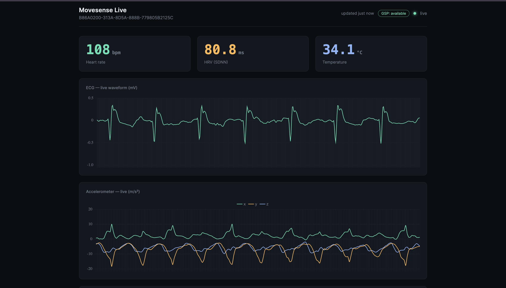

# Movesense Live Dashboard

Streams live heart rate, ECG, IMU9 (accelerometer + gyroscope +
magnetometer), and temperature from a Movesense MD sensor to a browser
dashboard over Bluetooth Low Energy — no phone app in the middle. A
live HRV (SDNN) estimate is also computed from the heart-rate signal,
but its accuracy depends heavily on electrode contact quality and
hasn't been validated under controlled (resting, well-fitted strap)
conditions yet — treat it as experimental for now.

ECG, IMU9, and temperature arrive as small binary payloads that
Movesense doesn't publish a written byte-layout spec for. Rather than
guess, the layout here was reverse-engineered from live captures and
checked against physics before trusting it: decoded accelerometer
samples read ~9.8 m/s² at rest (Earth's gravity); decoded ECG samples,
scaled by Movesense's own published LSB→mV conversion factor, produce a
smooth, physiologically plausible signal at exactly the subscribed rate;
decoded temperature reads ~34 °C against skin, and a byte-order swap
caught during verification would otherwise have silently reported 0
Kelvin. The magnetometer is the one channel still unconfirmed — see
below for why its obvious check doesn't actually work.
See [How the byte format was verified](#how-the-byte-format-was-verified)
for the actual method, and [Architecture](#architecture) for the
full picture.

## Demo



*Live capture from the dashboard: heart rate, HRV and skin temperature
across the top, with the decoded ECG waveform and accelerometer axes
streaming below.*

To replace this with a live GIF: wear the sensor, run the app,
screen-record ~15 seconds of the numbers and charts updating live
(QuickTime's screen recording on macOS works fine), then convert:

```bash
ffmpeg -i demo.mov -vf "fps=12,scale=800:-1:flags=lanczos" -loop 0 docs/demo.gif
```

Drop the result at `docs/demo.gif` and swap the `` tag above for it.

## Requirements

- A Movesense MD sensor on **firmware 2.3.0 or later** (2.3.1 for the MD/
  medical variant specifically). GSP shipped as part of the default
  firmware starting there; on older firmware the GSP subscribe in this
  repo won't get a response. Check/update via the Movesense Showcase app.
  MD's certified firmware line is gated behind Movesense's medical
  software repository (request access via medical@movesense.com) rather
  than being publicly downloadable like the non-medical HR+/HR2/Flash line.
- Python 3.10+, and a machine with BLE (macOS, Linux, or Windows).
- `ffmpeg`, only if you're recording the demo GIF above.

## Architecture

```
Movesense MD sensor  --BLE-->  Python backend (bleak)  --WebSocket-->  Browser dashboard
                                     |
                                     +-- FastAPI serves /ws and /status
```

Two data paths run side by side:

- **Heart rate + HRV** — via the standard Bluetooth Heart Rate Service
  (BLE SIG spec, service 0x180D / characteristic 0x2A37). Bpm arrives
  pre-decoded; when the sensor also includes RR-intervals (flags bit 4),
  the backend keeps a rolling window of the last 60 and reports a live
  SDNN (standard deviation of RR intervals) as a rough HRV indicator.
  This is a simple, unfiltered SDNN — no ectopic-beat correction — so
  treat it as a live signal, not a clinical HRV number. Fully working.
- **ECG, IMU9, and temperature** — via Movesense's own GSP ("GATT
  SensorData Protocol"), built for exactly this case: a laptop or Pi
  that can't run their mobile SDK. All three ride the same GSP notify
  characteristic, distinguished by an 8-bit reference code chosen at
  subscribe time. ECG and IMU9 packets are `[uint32 LE timestamp_ms][payload]`
  (ECG: raw int16 LSBs scaled to mV; IMU9: three back-to-back blocks of
  N×{x,y,z} float32 samples for accelerometer/gyroscope/magnetometer, N
  derived from payload size). Temperature is the odd one out —
  `[float32 Kelvin][uint32 timestamp]`, timestamp *last*, unlike the
  other two. All of it is decoded and live now — the dashboard plots the
  ECG waveform plus all three IMU9 sensors (accelerometer, gyroscope,
  magnetometer) as separate three-axis traces. See the verification
  method below. The light paths (temperature) are subscribed before the heavy,
  continuous ones (ECG, IMU9) at connect time — subscribing them after
  the high-rate streams were already running sometimes got no
  acknowledgment at all, presumably the notification channel being busy.

## How the byte format was verified

Movesense's GSP spec documents the command/response envelope (HELLO,
SUBSCRIBE, response codes) but not the byte layout of the measurement
payload itself — that's proprietary ("SBEM"). Guessing at a binary
format for a biosignal and trusting it blind is worse than not decoding
it at all, so instead of reverse-engineering from vague hints, this
project:

1. Logged real raw payloads from the sensor for each measurement path.
2. Formed a hypothesis for the layout from the official Whiteboard API
   schemas (`movesense-api.md`, see References) — e.g. that a
   `Timestamp: uint32` field is part of the payload, matching what the
   ECG, IMU9, and Temperature schemas all document.
3. Decoded against that hypothesis and checked the result against
   something independently known to be true:
   - Accelerometer: `sqrt(x²+y²+z²)` should read ~9.8 m/s² when the
     sensor is roughly stationary (Earth's gravity). It did, across
     multiple samples.
   - Magnetometer: **not verified.** The obvious check — magnitude
     should sit in Earth's field range, ~25–65 µT — does not work on a
     stationary sensor. An uncalibrated MEMS magnetometer carries a
     hard-iron offset, so one orientation's magnitude measures that
     offset as much as the field; establishing the true field strength
     means rotating through many orientations and fitting a sphere,
     whose radius is the answer. Measured over a real recording the
     magnitude sits around 11 µT, tightly clustered (σ ≈ 1.2) — stable
     and structured rather than garbage, so the block boundaries are
     almost certainly right, but well under Earth's field and not
     something a single resting posture can confirm either way. Treat
     the magnetometer columns as raw uncalibrated output.
   - ECG: raw int16 samples × Movesense's published conversion factor
     (1 LSB = 0.000381469726563 mV) produced a smooth, continuous
     signal — not noise, not NaN, not saturated.
   - Temperature: the schema lists `Timestamp` before `Measurement`,
     so timestamp-first was the natural first guess — but that gave
     0.00 Kelvin (absolute zero, physically impossible for a device
     sitting against skin). Swapping the field order gave ~33.8 °C, a
     plausible skin-adjacent reading, confirming the wire order is the
     *reverse* of the schema's listing order. This is exactly the kind
     of error a plausibility check catches and a "did it crash?" check
     wouldn't — both readings parse cleanly as valid floats.
4. Only after those checks passed did each decoder go into
   `backend/movesense_ble.py` (`_decode_ecg`, `_decode_imu9`,
   `_decode_temp`) as the default path, along with unit tests that
   assert the same physics bounds (e.g. accelerometer magnitude within
   8.5–11.0 m/s²).

This is the difference between "it parses without crashing" and "it's
verified" — worth being explicit about for a biosignal, and a
reasonable template for decoding any undocumented binary sensor format.

## Setup

```bash
cd backend
pip install -r requirements.txt

python scan.py                                    # find your sensor's BLE address
cp .env.example .env                              # then edit .env with your address
uvicorn main:app --reload
```

Then open `frontend/index.html` in a browser (or serve it with any static
file server). It connects to `ws://localhost:8000/ws`.

To run the tests:

```bash
python -m unittest discover backend
```

## Recording

The dashboard's **Record** button captures a session and hands it back as
a ZIP: one CSV per stream plus a `meta.json`. The gear beside it picks
sample rates, which streams to include, and a free-text label that ends
up in both the filename and the metadata.

Sample rates deserve a warning. GSP has no GET verb, so there is no way
to ask the sensor which rates it supports, and subscribing at an
unsupported one is accepted and then silently delivers nothing. Starting
a recording therefore resubscribes, waits for packets to actually
arrive, and refuses to start if none do — restoring the previous working
rate rather than leaving the dashboard dead. Ten minutes of silently
empty recording is a worse outcome than being told up front.

Saving uses the browser's native save dialog
(`window.showSaveFilePicker`) so you choose the folder and name. That API
is Chromium-only and wants a secure context, so **serve the frontend over
HTTP rather than opening it as a `file://` URL** if you want the dialog:

```bash
python -m http.server 8080 --directory frontend
```

Elsewhere — Safari, Firefox — it falls back to an ordinary download and
the dialog text says so.

### CSV format

Every CSV starts with the same four time columns, so one loader reads
them all. `t_device_ms` is empty where the stream has no device clock.

| file | rows | columns after the time block |
|---|---|---|
| `ecg.csv` | one per sample | `ecg_mv` |
| `imu.csv` | one per sample | `acc_x…z`, `gyro_x…z`, `magn_x…z` |
| `temp.csv` | one per reading | `temp_c` |
| `hr.csv` | one per notification | `bpm`, `sdnn_ms` |
| `rr.csv` | one per beat | `rr_ms`, `index_in_packet` |

Two things about the timestamps are worth understanding before using
this data, because both are easy to get wrong silently:

**Samples are spread within their packet.** BLE delivers ECG and IMU9 in
batches — one device timestamp and roughly sixteen samples per packet.
Stamping every sample in a packet with the packet's own time produces a
staircase, which corrupts inter-beat intervals and anything else derived
from sample spacing. Sample *i* is placed at `packet_timestamp + i/rate`
instead.

**There are two clocks, and both are kept.** The sensor's own clock has
accurate spacing but is relative to its boot; the host's wall clock is
absolute but carries BLE batching jitter. Rather than pick one:

- `t_s` — seconds since the recording started. Convenience axis.
- `t_device_ms` — the sensor's own monotonic clock, uint32 wraps undone.
- `t_unix` — absolute time derived from the device clock, anchored to the
  host clock once at the first packet. **Use this one for analysis.**
- `t_recv_unix` — when the packet reached the host. Samples from one
  packet share it, so the gap against `t_unix` is BLE latency.

`meta.json` records the anchor, the clock drift measured at stop, and a
count of packets that didn't follow on from their predecessor — a
non-zero count means packets were dropped and the timeline has holes.

Heart rate is the exception the columns admit to: the standard Bluetooth
Heart Rate Service carries no device timestamp at all, so `t_device_ms`
is empty there and `t_unix` can only be arrival time. Its raw
RR-intervals get their own file, since they, not the derived SDNN, are
what HRV work actually wants. Absolute beat times are deliberately *not*
reconstructed from them — a single dropped notification would make a
cumulative sum silently wrong, so that judgement is left to you.

```python
import pandas as pd
ecg = pd.read_csv("ecg.csv")
ecg["t_unix"].diff().describe()   # should sit at 1/rate
```

## Putting this on GitHub

This project has no real API keys or cloud credentials — the Movesense
connection is local BLE, FastAPI has no auth, and Chart.js is vendored at
`frontend/vendor/chart.umd.js` rather than pulled from a CDN, so the
dashboard needs no network access of its own. The only per-machine value
is `MOVESENSE_ADDRESS` in `.env`, and
that's not sensitive (it's a BLE address/UUID, not a credential) — it's
excluded from git via `.gitignore` mainly because it's local config, not
because it's dangerous if it leaked.

If you add real credentials later (a cloud API key for ECG analysis,
etc.), the same pattern applies: put them in `.env`, never in source, and
keep `.env.example` (with placeholder values) as the checked-in template.
As a backstop, GitHub's secret scanning + push protection are on by
default and free for public repos — they'll block a push that contains a
recognizable key pattern (AWS, Stripe, OpenAI, etc.) before it lands. That
catches known patterns, not custom ones like a bare device address, so
`.gitignore` is still doing the actual work here.

## Extending this

- **R-peak detection and ECG-derived HRV** (RMSSD, etc.) on top of the
  decoded ECG waveform, instead of deriving HRV only from the coarser
  RR-intervals the standard HR service provides.
- **Battery level** (`/System/Energy/Level`) was tried and pulled back
  out. The subscribe acknowledges fine (status 200), but the resource
  only notifies *on change* — there's no GET-style one-shot query in
  the GSP command set (just HELLO/SUBSCRIBE/UNSUBSCRIBE), and the
  battery percentage may simply not change during a normal session.
  Movesense's own Showcase app sidesteps this with an explicit "GET"
  button for this exact value rather than relying on push
  notifications. Worth revisiting if GSP ever exposes a real GET verb.
- **Signal quality indicator** for the ECG trace, since electrode
  contact quality visibly affects it.

## References

- Movesense MD Developer Kit spec — https://www.movesense.com/product/movesense-md-developer-kit-mdr/
- GATT SensorData Protocol (GSP) spec — https://www.movesense.com/docs/esw/gatt_sensordata_protocol/
- Movesense sample apps incl. `gatt_sensordata_app` + its Python client (parses ECG/IMU9 from SBEM) — https://www.movesense.com/docs/esw/sample_applications/
- Movesense system/mobile overview (Whiteboard vs GSP) — https://www.movesense.com/docs/system/system_overview/ , https://www.movesense.com/docs/mobile/mobile_sw_overview/
- Firmware 2.3.0 / 2.3.1 release notes (GSP becomes default firmware) — https://www.movesense.com/news/2024/12/movesense-firmware-update-2-3-0-a-perfect-holiday-gift-for-developers-and-researchers/ , https://www.movesense.com/news/2025/06/movesense-sensor-firmware-2-3-1-released-a-major-upgrade-for-medical-use/
- Movesense's official Python Datalogger Tool (also decodes SBEM, for flash recordings) — https://bitbucket.org/movesense/python-datalogger-tool
- sensein/movesense-py, a fork/extension of the above, including `docs/movesense-api.md` (Whiteboard schemas + the ECG LSB→mV conversion factor used here) — https://github.com/sensein/movesense-py
- Movesense news post cataloguing these official tools — https://www.movesense.com/news/2025/11/recording-data-with-movesense-sensors-five-free-tools-to-get-you-started/
- bleak (BLE library) docs — https://bleak.readthedocs.io/ , https://github.com/hbldh/bleak
- Bluetooth Heart Rate Service measurement format, corroborating source — https://blefyi.com/guide/python-bleak/
- Bluetooth SIG Heart Rate Service spec (RR-Interval field, used for the HRV/SDNN feature) — https://www.bluetooth.com/wp-content/uploads/Files/Specification/HTML/HRS_v1.0/out/en/index-en.html
- FastAPI lifespan events (pattern used in `main.py`) — https://fastapi.tiangolo.com/advanced/events/

## Notes

- `bleak` needs macOS, Linux, or Windows with BLE support. On Linux,
  stale GATT caching can cause `connect()` to hang — see bleak's
  troubleshooting docs.
- **macOS (Apple Silicon included, e.g. M1–M3):** fully supported, no
  Rosetta or extra setup needed — bleak's CoreBluetooth backend is
  native arm64. Two Mac-specific things to know:
  - The first time you run `scan.py` or `main.py`, macOS will prompt
    for Bluetooth access for whichever app is running the process
    (Terminal, iTerm, your editor's integrated terminal, etc). If you
    miss the prompt or deny it, you won't get a clear permission error
    — instead bleak raises something like "Bluetooth device is turned
    off" even though it's on. Fix via System Settings → Privacy &
    Security → Bluetooth, and re-run.
  - CoreBluetooth hides real BLE MAC addresses for privacy, so
    `scan.py` will print a macOS-generated UUID instead of an
    `XX:XX:XX:XX:XX:XX` address. That's expected — use it in
    `MOVESENSE_ADDRESS` exactly the same way; it only resolves back to
    your sensor on the same Mac that scanned it.
- **Running from an editor's integrated terminal:** works the same as
  running it from a plain shell — it's the same `pip install` /
  `uvicorn` commands. Two things that don't change with the tooling:
  - It has to run on your actual Mac, not a remote/cloud dev environment
    — BLE needs physical proximity to the sensor, so a cloud sandbox
    session has no way to reach it.
  - The Bluetooth permission prompt is tied to whichever app owns the
    process. If VS Code's integrated terminal runs it, macOS will ask
    for *VS Code's* Bluetooth permission specifically — separate from
    any permission you already granted Terminal.app.
